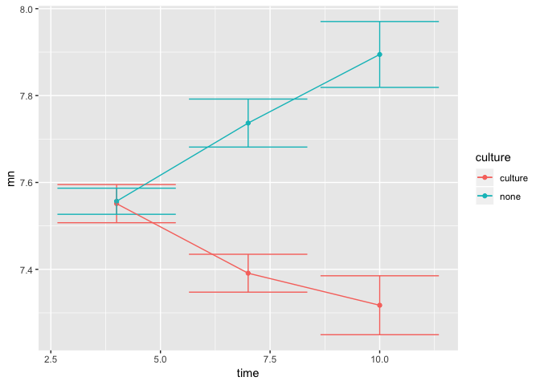

Cheese has been produced with, and without maturation culture to accelerate/differentiate maturation.
Aroma profiling is obtained from cheeses of age $4$, $7$ and $10$ weeks. 


# Set libraries and Import data

It is a good idea to start the script with setting the libraries you are going to use and then import data


```r
library(rio)
library(ggplot2)
X <- import('data/cheese_aromas.xlsx')
```

# Summary statistics

Use table() to figure out how many samples there are in the combination of time and maturation culture

Produce two sets of summary stats: 
First, descriptive stats for one variable for each design cell and 
Second, the mean value for all aroma compounds across all design cells. 

Use aggregate() for both. Here are some inspiration


```r
aggregate(X$`1Butanol`, list(X$ti...,X$...),function(x) c(length(x), mean(x),...))
```


```r
Xm <- aggregate(X, list(X$...),...)
```


# Plot of data

## Boxplot with points on top

We wish to make some plots of the raw data emphasizing the design. So make a plot using ggplot() (from the ggplot2 package) to plot the design on the x-axis and some aroma comound on the y-axis, with a boxplot in the background and the individual observations as points. 

Should look something like this

<!-- -->

and here are some code for inspiration


```r
ggplot(data = X, aes(time_culture,...)) + 
  geom_boxplot() + ...
```

## Scatter plot of two aroma compounds

Try to make the following, and see what is going on.


```r
ggplot(data = X, aes(`1Butanol`, `1Propanol`, 
                     color = factor(time_weeks), 
                     shape = maturation_culture)) + 
  geom_point() + 
  stat_ellipse() 
```

* Try to make a scatter plot as above, but now add a (_straight_) line through the points by adding stat_smooth(). 
If you only want one line, then the coloring and shapes should be removed. 

* __Difficult__: can you figure out if it is possible to have a plot with colors, shapes and ellipses BUT only one straight line? 

## Lineplot with errorbars

Instead of plotting the raw data, lets plot the mean value and put on some error-bars. Still with the x-axis and y-axis being the same. 

We need a bit tricky version of aggregate() to make it work. And furhter some renaming.


```r
Xag <- do.call(data.frame,
               aggregate(X$`1Butanol`, 
                         list(X$time_weeks,X$maturation_culture), 
                         function(x) c(mean(x), sd(x)))
)

colnames(Xag) <- c('time','culture','mn','sd')

ggplot(data = Xag, aes(time,mn, color = culture, ymin = mn - sd, ymax = mn+sd)) + 
  geom_point() + 
  geom_errorbar() + 
  geom_line()
```

<!-- -->

# T-test
In the figure above it is not clear if week 7 and 10 for samples with added culture are significantly different. To find out we can perform a perform a T-test. T-tests can be done by using the function _t.test_ - try to use the commands ?t.test or help(t.test) for help. Try to make a t-test on the difference in 1-butanol between week 7 and 10 for samples with culture.

You could consider to subset the original data.


```r
Xtemp <- subset(X,...)
w7 <- subset(Xtemp,...)
w10 <- ...

t.test(w7$`1Butanol`...)
```


# Linear models and ANOVA
In the above example there were three time points and not only the two used for the t.test. If we want to analyse the effect of time we should to an analysis of variance ANOVA. This can be done by making a linear model with lm(y~x). This model can yield the ANOVA table by being passed to the anova function.

* Try to do a ANOVA on the culture samples with all time points (should time points be continuous or discrete?)
    + subset(X...)
    + lm(1-butanol~time)
    + anova(mdl)

* Do the model assumptions hold? (Normally distributed residuals, try plot(mdl))
* Extract the coefficients and compare them to the line plot above. 


This could also be analysed as a two-way anova as there are in fact two design (experimental) factors!


# PCA

15-16	: PCA with ggbiplot* and extraction of scores/loads -> into data.frame and ggplot2 plots

PCA model on some data
ggbiplot those including some ellipses and colors

extract scores
- do the score plot with labels, facet_wrap 


