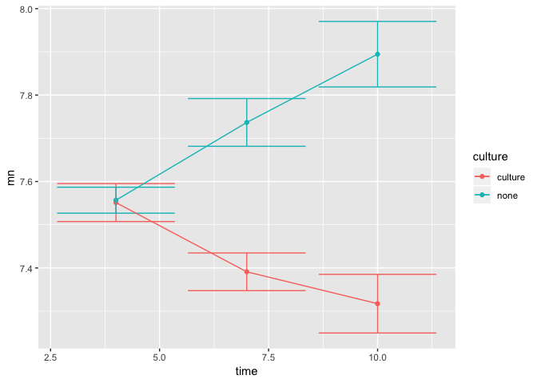
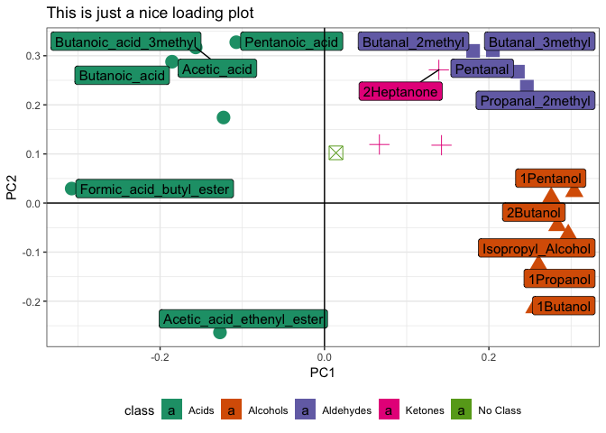

Exercise - Aroma-profiling in Cheese (ANSWERS)
================

-   [Set libraries and Import data](#set-libraries-and-import-data)
-   [Summary statistics](#summary-statistics)
    -   [Answers](#answers)
-   [Plot the data](#plot-the-data)
    -   [Boxplot with points on top](#boxplot-with-points-on-top)
        -   [Answer](#answer)
        -   [Answer](#answer-1)
    -   [Scatter plot of two aroma compounds](#scatter-plot-of-two-aroma-compounds)
        -   [Answer](#answer-2)
        -   [Answer](#answer-3)
        -   [Answer](#answer-4)
    -   [Lineplot with errorbars](#lineplot-with-errorbars)
        -   [Answer](#answer-5)
-   [T-test](#t-test)
    -   [Answer](#answer-6)
-   [Linear models and ANOVA](#linear-models-and-anova)
    -   [Answer](#answer-7)
    -   [Answer](#answer-8)
-   [PCA](#pca)
    -   [Install the ggbiplot package](#install-the-ggbiplot-package)
    -   [Make the PCA model](#make-the-pca-model)
    -   [Plot the model](#plot-the-model)
        -   [Answer](#answer-9)
    -   [Customize the plot from scratch.](#customize-the-plot-from-scratch.)
        -   [On Scores](#on-scores)
            -   [Answer](#answer-10)
        -   [On Loadings](#on-loadings)
            -   [Answer](#answer-11)

Cheese has been produced with, and without maturation culture to accelerate/differentiate maturation. Aroma profiling is obtained from cheeses of age *4*, *7* and *10* weeks.

Set libraries and Import data
=============================

It is a good idea to start the script with setting the libraries you are going to use and then import data

``` r
library(rio)
```

    ## The following rio suggested packages are not installed: 'csvy', 'feather', 'fst', 'hexView', 'readODS', 'rmatio'
    ## Use 'install_formats()' to install them

``` r
library(ggplot2)
X <- import('data/cheese_aromas.xlsx')
```

Summary statistics
==================

Use table() to figure out how many samples there are in the combination of time and maturation culture

Produce two sets of summary stats: First, descriptive stats for one variable for each design cell and Second, the mean value for all aroma compounds across all design cells.

Use aggregate() for both. Here you get some inspiration

``` r
aggregate(X$`1Butanol`, list(X$ti...,X$...),function(x) c(length(x), mean(x),...))
```

``` r
Xm <- aggregate(X, list(X$...),...)
```

Answers
-------

``` r
aggregate(X$`1Butanol`, 
          list(X$time_weeks,X$maturation_culture),
          function(x) c(length(x), mean(x), sd(x), min(x), max(x)))
```

    ##   Group.1 Group.2        x.1        x.2        x.3        x.4        x.5
    ## 1       4 culture 4.00000000 7.55126674 0.04391576 7.49283452 7.58820478
    ## 2       7 culture 5.00000000 7.39114520 0.04358967 7.34402937 7.44951422
    ## 3      10 culture 6.00000000 7.31741925 0.06783257 7.21151920 7.40316816
    ## 4       4    none 6.00000000 7.55678481 0.03004764 7.51631387 7.60017655
    ## 5       7    none 6.00000000 7.73671457 0.05523241 7.67189254 7.80647240
    ## 6      10    none 5.00000000 7.89461207 0.07581167 7.77225843 7.96464356

``` r
Xm <- aggregate(X, list(X$time_weeks,X$maturation_culture),mean)
```

Plot the data
=============

Boxplot with points on top
--------------------------

We wish to make some plots of the raw data emphasizing the experimental design. So make a plot using ggplot() (from the ggplot2 package) to plot the design on the x-axis and some aroma compound on the y-axis, with a boxplot in the background and the individual observations as points.

Here you have some code for inspiration

``` r
ggplot(data = X, aes(time_culture,...)) + 
  geom_boxplot() + ...
```

### Answer

``` r
ggplot(data = X, aes(time_culture,`1Butanol`, fill = maturation_culture)) + 
  geom_boxplot() + 
  geom_point()
```


-   Try to change the x and y labels to make your plot look nicer (hint: add ylab("Your label name here")). To change the size of your axis titles, add: theme(axis.title=element\_text(size=14))

### Answer

``` r
ggplot(data = X, aes(time_culture,`1Butanol`, fill = maturation_culture)) + 
  geom_boxplot() + 
  geom_point() + 
  ylab('Response - 1-Butanol') + 
  theme(axis.title=element_text(size=14))
```


-   **Extra**: What do you think the following code does? Try to add it to your plot:

``` r
theme(axis.text.x = element_text(angle = 45, hjust = 1))
```

-   **Extra**: If there is time, play around with the geoms, and try change your previous plots to these (or other variations, if you prefer):

``` r
library(gridExtra)
p1 <- ggplot(data = X, aes(time_culture,`1Butanol`, fill = maturation_culture)) + 
  geom_boxplot() + 
  geom_jitter(color="blue") +
  theme(legend.position="top") +
  theme(axis.text.x = element_text(angle = 45, hjust = 1)) +
  ylab("1-Propanol") + xlab("1-Butanol") +
  labs(fill='Maturation culture')

p2 <- ggplot(data = X, aes(time_culture,`1Butanol`, color = maturation_culture)) + 
  geom_violin() +
  theme(legend.position="top") +
  theme(axis.text.x = element_text(angle = 45, hjust = 1)) +
  ylab("1-Propanol") + xlab("1-Butanol") +
  labs(color='Maturation culture')

grid.arrange(p1,p2,ncol=2)
```


Scatter plot of two aroma compounds
-----------------------------------

Try to make the following, and see what is going on.

``` r
ggplot(data = X, aes(`1Butanol`, `1Propanol`, 
                     color = factor(time_weeks), 
                     shape = maturation_culture)) + 
  geom_point() + 
  stat_ellipse() 
```

-   Try to change the size of the points. Note the difference if you put the size argument inside our outside of the aes() environment. Why do you think that is?

-   Try to make a scatter plot as above, but now add a (*straight*) line through the points by adding stat\_smooth(). If you only want one line, then the coloring and shapes should be removed.

### Answer

Could look something like this:

``` r
ggplot(data = X, aes(`1Butanol`, `1Propanol`)) + 
  geom_point() + 
  stat_smooth(method='lm') +
  ylab('1-Propanol') +
  xlab('1-Butanol') 
```


-   **Difficult**: can you figure out if it is possible to have a plot with colors, shapes and ellipses BUT only one straight line?

### Answer

In order to avoid the grouping to also go onto stat\_smooth(), the groups are overrulled in the stat\_smooth() by setting it to something with *Only* one level.

``` r
ggplot(data = X, aes(`1Butanol`, `1Propanol`, color = time_culture, shape = maturation_culture)) + 
  geom_point() +
  stat_ellipse() + 
  stat_smooth(method='lm', aes(group = 1)) +
  ylab('1-Propanol') +
  xlab('1-Butanol') 
```


-   **Extra**: Sometimes it is not a good idea to overload plots with information. In this case using both a color and a shape to convey information can be confusing for the reader. Try to remove the shapes and use facet\_wrap(~maturation\_culture) to separate the two maturation types into two plots.

### Answer

We remove the shape aestetics, but still forces there only to be one line per plot. This however, is tied to the individal plots and are *not* the same between the two plots.

``` r
ggplot(data = X, aes(`1Butanol`, `1Propanol`, color = time_culture)) + 
  geom_point() +
  stat_ellipse() + 
  facet_wrap(~maturation_culture) + 
  stat_smooth(method='lm', aes(group = maturation_culture)) +
  ylab('1-Propanol') +
  xlab('1-Butanol') 
```


Lineplot with errorbars
-----------------------

Instead of plotting the raw data, lets plot the mean value and put on some error-bars. Still with the x-axis and y-axis being the same.

We need a bit tricky version of aggregate() to make it work. And further some renaming.

``` r
Xag <- do.call(data.frame,
               aggregate(X$`1Butanol`, 
                         list(X$time_weeks,X$maturation_culture), 
                         function(x) c(mean(x), sd(x)))
)

colnames(Xag) <- c('time','culture','mn','sd')
```

-   Try to make a plot that looks like the one below.

Some code to get you started (hint: layer your plot one geom at a time, and use geom\_errorbar() to add the errorbars):

``` r
ggplot(data = Xag, aes(time,mn, color = culture, ymin = mn - sd, ymax = mn+sd)) + 
  ...
```

### Answer

``` r
ggplot(data = Xag, aes(time,mn, color = culture, ymin = mn - sd, ymax = mn+sd)) + 
  geom_point() +
  geom_errorbar() +
  geom_line() 
```



T-test
======

In the figure above it is not clear if week 7 and 10 for samples with added culture are significantly different. To find out we can perform a perform a T-test. T-tests can be done by using the function *t.test* - try to use the commands ?t.test or help(t.test) for help. Try to make a t-test on the difference in 1-butanol between week 7 and 10 for samples with culture.

You could consider to subset the original data.

``` r
Xtemp <- subset(X,...)
w7 <- subset(Xtemp,...)
w10 <- ...

t.test(w7$`1Butanol`...)
```

Or in a more comprehensive way, simply *only* include the data which you want to use.

``` r
t.test(data = X[X$time_weeks %in% c(7,10) & X$maturation_culture=='culture',], 
       `1Butanol` ~ time_weeks)
```

    ## 
    ##  Welch Two Sample t-test
    ## 
    ## data:  1Butanol by time_weeks
    ## t = 2.177, df = 8.5567, p-value = 0.05898
    ## alternative hypothesis: true difference in means is not equal to 0
    ## 95 percent confidence interval:
    ##  -0.003492978  0.150944876
    ## sample estimates:
    ##  mean in group 7 mean in group 10 
    ##         7.391145         7.317419

In any case you should get exactly the same answer.

Answer
------

``` r
Xtemp <- subset(X,maturation_culture=="culture")
w7 <- subset(Xtemp,time_weeks == c("7"))
w10 <- subset(Xtemp,time_weeks == 10)
t.test(w7$`1Butanol`,w10$`1Butanol`)
```

    ## 
    ##  Welch Two Sample t-test
    ## 
    ## data:  w7$`1Butanol` and w10$`1Butanol`
    ## t = 2.177, df = 8.5567, p-value = 0.05898
    ## alternative hypothesis: true difference in means is not equal to 0
    ## 95 percent confidence interval:
    ##  -0.003492978  0.150944876
    ## sample estimates:
    ## mean of x mean of y 
    ##  7.391145  7.317419

Linear models and ANOVA
=======================

In the above example there were three time points and not only the two used for the t.test. If we want to analyze the effect of time we should to an analysis of variance ANOVA. This can be done by making a linear model with lm(y~x). This model can yield the ANOVA table by being passed to the anova() function.

-   Try to do a ANOVA on the culture samples with all time points (should time points be continuous or discrete?)
-   subset(X...)
-   lm(1-butanol~time)
-   anova(mdl)

-   Do the model assumptions hold? (Normally distributed residuals, try plot(mdl))
-   Extract the coefficients and compare them to the line plot above.

Answer
------

``` r
Xc <- subset(X,maturation_culture=="culture")
mdl <- lm(data = Xc, `1Butanol`~factor(time_weeks)-1)
anova(mdl)
```

    ## Analysis of Variance Table
    ## 
    ## Response: 1Butanol
    ##                    Df Sum Sq Mean Sq F value    Pr(>F)    
    ## factor(time_weeks)  3 822.50 274.166   90404 < 2.2e-16 ***
    ## Residuals          12   0.04   0.003                      
    ## ---
    ## Signif. codes:  0 '***' 0.001 '**' 0.01 '*' 0.05 '.' 0.1 ' ' 1

``` r
summary(mdl)
```

    ## 
    ## Call:
    ## lm(formula = `1Butanol` ~ factor(time_weeks) - 1, data = Xc)
    ## 
    ## Residuals:
    ##       Min        1Q    Median        3Q       Max 
    ## -0.105900 -0.031603 -0.007959  0.033692  0.085749 
    ## 
    ## Coefficients:
    ##                      Estimate Std. Error t value Pr(>|t|)    
    ## factor(time_weeks)4   7.55127    0.02753   274.2   <2e-16 ***
    ## factor(time_weeks)7   7.39115    0.02463   300.1   <2e-16 ***
    ## factor(time_weeks)10  7.31742    0.02248   325.5   <2e-16 ***
    ## ---
    ## Signif. codes:  0 '***' 0.001 '**' 0.01 '*' 0.05 '.' 0.1 ' ' 1
    ## 
    ## Residual standard error: 0.05507 on 12 degrees of freedom
    ## Multiple R-squared:      1,  Adjusted R-squared:  0.9999 
    ## F-statistic: 9.04e+04 on 3 and 12 DF,  p-value: < 2.2e-16

``` r
coefficients(mdl)
```

    ##  factor(time_weeks)4  factor(time_weeks)7 factor(time_weeks)10 
    ##             7.551267             7.391145             7.317419

``` r
par(mfrow=c(2,2)); plot(mdl)
```


This could also be analyzed as a two-way anova as there are in fact two design (experimental) factors!

Answer
------

``` r
mdl2 <- lm(data = X, `1Butanol`~maturation_culture*time_weeks)
plot(mdl2)
```


``` r
anova(mdl2)
```

    ## Analysis of Variance Table
    ## 
    ## Response: 1Butanol
    ##                               Df  Sum Sq Mean Sq  F value    Pr(>F)    
    ## maturation_culture             1 0.79219 0.79219 258.6615 1.128e-15 ***
    ## time_weeks                     1 0.02668 0.02668   8.7125  0.006328 ** 
    ## maturation_culture:time_weeks  1 0.41322 0.41322 134.9225 3.199e-12 ***
    ## Residuals                     28 0.08575 0.00306                       
    ## ---
    ## Signif. codes:  0 '***' 0.001 '**' 0.01 '*' 0.05 '.' 0.1 ' ' 1

PCA
===

Here we want to make a PCA model on the multivariate data ( *22 GC features* ). That is a low-rank, or *simple* representation of what goes on in all 22 directions in (here) two dimensions.

The PCA model it self can be calculated using *build-in* functionality in R, but the plotting requires some additional packages.

Install the ggbiplot package
----------------------------

There are several places, where packages are made available for download and use. One of the is *github*. The package that we are going to use is appearing here. One really nice thing in R, is that the download and installation of packages is done directly from R. So no need to use a browser, point-and-click. However, you will need another package for getting the package. Namely the *devtools* package.

``` r
install.packages('devtools')
```

Then using this library we can get ggbiplot

``` r
library(devtools)
install_github('vqv/ggbiplot')
```

Make the PCA model
------------------

Use the prcomp() function to make a PCA model on *the response variables* DO NOT include design! Further, remember to pre-treat the input data using centering and scaling.

``` r
PCAmdl <- prcomp(X[,4:...], scale. = T, center = T)
```

Plot the model
--------------

A vanilla version plot of the PCA model looks as follows:

``` r
library(ggbiplot)
ggbiplot(PCAmdl)
```


As this function is engined by ggplot() most of the modification that can be used by ggplot() can also be used here. Specifically, you might want to extend the axes in order to be able to see the labels on the loadings. That is done by adding xlim(c(low\_limit,high\_limit)) to the plot (similarly for ylim()). Try to do this.

The ggbiplot() function can included classes for the scores (that is if the samples are from different groups). In this case we a design, so try to incorporate this via the groups = argument in the function. Further, set the argument ellipse = TRUE to get some even nicer representation.

### Answer

``` r
ggbiplot(PCAmdl, groups = X$time_culture, ellipse = TRUE)
```


Customize the plot from scratch.
--------------------------------

Although ggbiplot() fulfills most needs in terms of PCA visualization, you might want to make the plot even specific. In that case, the way to go, is to 1) export the scores or loadings and put them into a data.frame and 2) use ggplot() to make exactly the version you want.

### On Scores

As an example of something which might could be useful, is three individual score plots; one for each time point.

In order to make that we do:

``` r
scores <- data.frame(X, PCAmdl$x) # extract scores and put into data.frame combined with design (and original data)
head(scores,2)
```

    ##   maturation_culture time_weeks   time_culture X1Butanol X1Propanol
    ## 1            culture          4 04uger_culture  7.542316   4.108593
    ## 2            culture          4 04uger_culture  7.492835   4.142102
    ##   X2Butanol Isopropyl_Alcohol X1Pentanol X2Pentanol  Acetone  Butanal
    ## 1  7.025338          6.479134   6.602876   4.872258 6.689937 4.867165
    ## 2  6.951893          6.625942   6.578138   4.792159 6.994308 4.957335
    ##   Butanal_2methyl Butanal_3methyl Propanal_2methyl X2Heptanone
    ## 1        6.572955        7.125086         6.394694    7.078801
    ## 2        6.870942        7.375913         6.678770    7.091987
    ##   Butanoic_acid_3methyl Butanoic_acid Acetic_acid Pentanoic_acid
    ## 1              3.490007      2.826384    5.223277       1.725756
    ## 2              3.169435      2.123829    4.905353       1.546119
    ##   Formic_acid_butyl_ester Propanoic_acid_2hydroxy_ethyl_ester
    ## 1                5.922506                            1.886282
    ## 2                5.915372                            1.762319
    ##   Acetic_acid_ethenyl_ester Pentanal X2Butanone   Nonane       PC1
    ## 1                  7.008109 6.839849   8.404732 5.446106 -3.199387
    ## 2                  6.839216 6.920548   8.410900 5.771083 -2.209928
    ##          PC2      PC3       PC4        PC5       PC6         PC7       PC8
    ## 1 -0.1222409 2.193389 -1.689694 -0.2408070 0.6711684 -0.01894841 0.7477768
    ## 2  0.2324992 3.124559 -2.220143 -0.5838099 0.7608341  0.61886464 0.5762888
    ##           PC9         PC10        PC11       PC12       PC13        PC14
    ## 1 -0.01172872 -0.005058009 -0.08848177 0.06731906 0.04453961  0.07121666
    ## 2  0.72343630 -0.742602661  0.19935638 0.05851943 0.38476215 -0.37115335
    ##            PC15       PC16        PC17        PC18         PC19
    ## 1 -0.0464973288 0.09346433 -0.02116017 -0.04722489 -0.008143801
    ## 2  0.0006669017 0.25174015 -0.07465636  0.06286470 -0.029978391
    ##          PC20        PC21        PC22
    ## 1 -0.03668081 -0.07363705  0.04123002
    ## 2 -0.03161958  0.07170486 -0.02150698

You see that in addition to the original data, columns with PC1, PC2,..., PC22 is added.

Lets plot them:

``` r
ggplot(data = scores,aes(PC1,PC2, color = maturation_culture)) + 
  geom_point() + 
  geom_hline(yintercept = 0) + 
  geom_vline(xintercept = 0)
```


Now try to make modifications to the code to get something like this.

HINT: you will need to play around with facet\_wrap() or facet\_grid(), stat\_ellipse(), theme\_bw() and some general settings in theme().

#### Answer


### On Loadings

Here, we only have *22* variables, but we might have situations where there are way more. In such situations it would be nice to make the plot interpretable without having to scrutinize to much. One such way, is to add information on the points. Here in the form of classes:

These variables are aroma compounds and can be subdivided into the chemical categories:

-   Alcohols
-   Aldehydes
-   Ketones
-   Acids

We would like to infer this information in different ways, but first of all we need to set up the loadings in a data.frame() and define class from the name of the variable.

``` r
loadings <- data.frame(PCAmdl$rotation)
loadings$name <- rownames(loadings)

loadings$class <- 'No Class'
# Alcohols
loadings$class[grepl('ol',loadings$name)] <- 'Alcohols'
# Aldehydes 
loadings$class[grepl('al',loadings$name)] <- 'Aldehydes'
# Ketones 
loadings$class[grepl('one',loadings$name)] <- 'Ketones'
# Acids
loadings$class[grepl('acid',loadings$name)] <- 'Acids'

table(loadings$class)
```

    ## 
    ##     Acids  Alcohols Aldehydes   Ketones  No Class 
    ##         7         6         5         3         1

``` r
loadings$name[loadings$class=='No Class'] 
```

    ## [1] "Nonane"

Lets plot the loadings, color- and shape according to molecular class and put on labels.

``` r
ggplot(data = loadings, aes(PC1, PC2, color = class, label = name, shape = class)) + 
  geom_point(size = 10) + 
  geom_text() + 
  geom_hline(yintercept = 0) + 
  geom_vline(xintercept = 0)  
```


You are pretty happy with this plot, but not totally satisfied!

Try to play around with **label size**, **coloring**, **theme** and **label position** to get things more clear.

Something like below is doable but how?

HINT: For the displacement of the labels you'll need a package called ggrepel.

A HARD one: The de-selection of some labels is a pretty hard task, but try to google and see if you can figure this one out!

#### Answer

Import the ggrepel package from where it is located (google it!), then the code below does the job, but please understand the individual parts of it. I.e. what does each line do to the plot?


