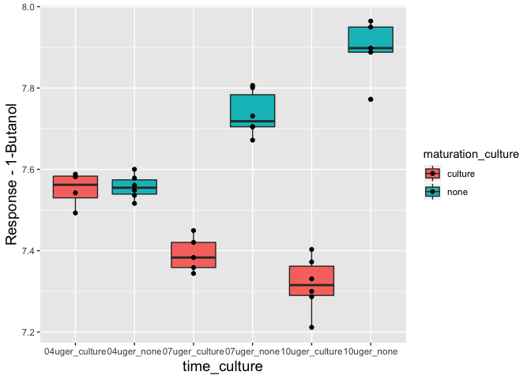

Reproducible Data Analysis with R
================

-   [The default report](#the-default-report)
-   [Other output formats](#other-output-formats)
-   [Include ggplot2 output](#include-ggplot2-output)
-   [TOC](#toc)
-   [Chuck settings](#chuck-settings)
    -   [Global is in the top of the document](#global-is-in-the-top-of-the-document)
    -   [Local is in the top of each chunck](#local-is-in-the-top-of-each-chunck)
-   [Tables](#tables)
-   [Nice'r tables](#nicer-tables)
-   [A presentation](#a-presentation)

Exercises for *Reproducible data analysis using R* at Dept FOOD UPCH.

This course is a code-along 2-hours short course, where we try to learn functionallity by solving some problems.

We are not going to focus on the specifics of the data analysis. But it would be very useful if you have a data analysis task which you have done using an R-script with data import, figure production and analysis. Then the last part of combining these outputs pieces into a report is what we will focus on here.

You will see that it is basically some copy-pasting from the R-script into a Rmarkdown document and adding some narrative and structure around it!

The intention is that you should see what is possible, and be able to do some task your self. However, most of the functionallity will need a bit of googleling... so please try to use this resourse efficiently when you do data analysis.

The default report
==================

Make the report with default to html. I.e. File -&gt; New File -&gt; R Markdown...

Other output formats
====================

Try to exchange / add other output formats like word and pdf. Be aware that this might need additional installations, such as an latex engine. If not doable, then stick with html.

``` r
---
title: "My report"
author: "Anna Haldrup"
date: "today in 2019"
output: 
  pdf_document
---
```

Include ggplot2 output
======================

Extend the report to include data import and vizualisation using ggplot2.

``` r
library(rio)
library(ggplot2)
X <- import('data/cheese_aromas.xlsx')
ggplot(data = X, aes(time_culture,`1Butanol`, fill = maturation_culture)) + 
  geom_boxplot() + 
  geom_point() + 
  ylab('Response - 1-Butanol') + 
  theme(axis.title=element_text(size=14))
```



TOC
===

Add headings \#, \#\#, \#\#\# .. and figure out how to modify the title/authour/output part to include a table of content (toc)

``` r
---
title: "My report"
author: "Anna Haldrup"
date: "today in 2019"
output: 
  html_document: 
    toc: true
    toc_depth: 5

---
```

Chuck settings
==============

Global and individual chunk settings. default might not allways be the nicer option. For instance, the figures are left aligned.

Global is in the top of the document
------------------------------------

``` r
#```{r setup, include=FALSE}
#  knitr::opts_chunk$set(echo = TRUE)
#```
```

Local is in the top of each chunck
----------------------------------

``` r
#```{r, ...., fig.height = ??, include = ??,....}
```

-   Try to align figures such that all are centered
-   Try to turn of all the code in the final report. That is, the code is executed but not shown.
-   Try to modify a local chunk such that it is shown, but not executed.

Tables
======

Install (if it is not already!) and use the knitr package to produce tables with the kable() function. Include caption and number of digits.

``` r
library(knitr)
df <- do.call(data.frame,aggregate(X$`1Butanol`, 
          list(X$time_weeks,X$maturation_culture),
          function(x) c(length(x), mean(x), sd(x), min(x), max(x))))
colnames(df) <- c('week','culture','n','mean','sd','min','max')

kable(df, digits = 1)
```

|  week| culture |    n|  mean|   sd|  min|  max|
|-----:|:--------|----:|-----:|----:|----:|----:|
|     4| culture |    4|   7.6|  0.0|  7.5|  7.6|
|     7| culture |    5|   7.4|  0.0|  7.3|  7.4|
|    10| culture |    6|   7.3|  0.1|  7.2|  7.4|
|     4| none    |    6|   7.6|  0.0|  7.5|  7.6|
|     7| none    |    6|   7.7|  0.1|  7.7|  7.8|
|    10| none    |    5|   7.9|  0.1|  7.8|  8.0|

Nice'r tables
=============

If you really want to make tables looking nice, then check out the kableExtra package, and its functionallity. simply try to copy paste some of the codes here into your document see <https://cran.r-project.org/web/packages/kableExtra/vignettes/awesome_table_in_html.html>

You want to be able to do something like this:

``` r
library(kableExtra)
library(tidyverse)
kable(df,digits = 1) %>%
  kable_styling("striped", full_width = F) %>%
  column_spec(1:2, bold = T) %>%
  row_spec(c(1,3,4,6), bold = T, color = "white", background = "#D7261E")
```

<table class="table table-striped" style="width: auto !important; margin-left: auto; margin-right: auto;">
<thead>
<tr>
<th style="text-align:right;">
week
</th>
<th style="text-align:left;">
culture
</th>
<th style="text-align:right;">
n
</th>
<th style="text-align:right;">
mean
</th>
<th style="text-align:right;">
sd
</th>
<th style="text-align:right;">
min
</th>
<th style="text-align:right;">
max
</th>
</tr>
</thead>
<tbody>
<tr>
<td style="text-align:right;font-weight: bold;font-weight: bold;color: white;background-color: #D7261E;">
4
</td>
<td style="text-align:left;font-weight: bold;font-weight: bold;color: white;background-color: #D7261E;">
culture
</td>
<td style="text-align:right;font-weight: bold;color: white;background-color: #D7261E;">
4
</td>
<td style="text-align:right;font-weight: bold;color: white;background-color: #D7261E;">
7.6
</td>
<td style="text-align:right;font-weight: bold;color: white;background-color: #D7261E;">
0.0
</td>
<td style="text-align:right;font-weight: bold;color: white;background-color: #D7261E;">
7.5
</td>
<td style="text-align:right;font-weight: bold;color: white;background-color: #D7261E;">
7.6
</td>
</tr>
<tr>
<td style="text-align:right;font-weight: bold;">
7
</td>
<td style="text-align:left;font-weight: bold;">
culture
</td>
<td style="text-align:right;">
5
</td>
<td style="text-align:right;">
7.4
</td>
<td style="text-align:right;">
0.0
</td>
<td style="text-align:right;">
7.3
</td>
<td style="text-align:right;">
7.4
</td>
</tr>
<tr>
<td style="text-align:right;font-weight: bold;font-weight: bold;color: white;background-color: #D7261E;">
10
</td>
<td style="text-align:left;font-weight: bold;font-weight: bold;color: white;background-color: #D7261E;">
culture
</td>
<td style="text-align:right;font-weight: bold;color: white;background-color: #D7261E;">
6
</td>
<td style="text-align:right;font-weight: bold;color: white;background-color: #D7261E;">
7.3
</td>
<td style="text-align:right;font-weight: bold;color: white;background-color: #D7261E;">
0.1
</td>
<td style="text-align:right;font-weight: bold;color: white;background-color: #D7261E;">
7.2
</td>
<td style="text-align:right;font-weight: bold;color: white;background-color: #D7261E;">
7.4
</td>
</tr>
<tr>
<td style="text-align:right;font-weight: bold;font-weight: bold;color: white;background-color: #D7261E;">
4
</td>
<td style="text-align:left;font-weight: bold;font-weight: bold;color: white;background-color: #D7261E;">
none
</td>
<td style="text-align:right;font-weight: bold;color: white;background-color: #D7261E;">
6
</td>
<td style="text-align:right;font-weight: bold;color: white;background-color: #D7261E;">
7.6
</td>
<td style="text-align:right;font-weight: bold;color: white;background-color: #D7261E;">
0.0
</td>
<td style="text-align:right;font-weight: bold;color: white;background-color: #D7261E;">
7.5
</td>
<td style="text-align:right;font-weight: bold;color: white;background-color: #D7261E;">
7.6
</td>
</tr>
<tr>
<td style="text-align:right;font-weight: bold;">
7
</td>
<td style="text-align:left;font-weight: bold;">
none
</td>
<td style="text-align:right;">
6
</td>
<td style="text-align:right;">
7.7
</td>
<td style="text-align:right;">
0.1
</td>
<td style="text-align:right;">
7.7
</td>
<td style="text-align:right;">
7.8
</td>
</tr>
<tr>
<td style="text-align:right;font-weight: bold;font-weight: bold;color: white;background-color: #D7261E;">
10
</td>
<td style="text-align:left;font-weight: bold;font-weight: bold;color: white;background-color: #D7261E;">
none
</td>
<td style="text-align:right;font-weight: bold;color: white;background-color: #D7261E;">
5
</td>
<td style="text-align:right;font-weight: bold;color: white;background-color: #D7261E;">
7.9
</td>
<td style="text-align:right;font-weight: bold;color: white;background-color: #D7261E;">
0.1
</td>
<td style="text-align:right;font-weight: bold;color: white;background-color: #D7261E;">
7.8
</td>
<td style="text-align:right;font-weight: bold;color: white;background-color: #D7261E;">
8.0
</td>
</tr>
</tbody>
</table>
By the way: Find your favorite color here: <https://www.what-if.com/colours/standard-216-colour-palette/>

...Or maybe you have a picture with a color and want to figure out its code: <https://www.colorcodepicker.com/>

For instance, the color here is the main color in UCPH-Science logo:

<table class="table table-striped" style="width: auto !important; margin-left: auto; margin-right: auto;">
<thead>
<tr>
<th style="text-align:right;">
week
</th>
<th style="text-align:left;">
culture
</th>
<th style="text-align:right;">
n
</th>
<th style="text-align:right;">
mean
</th>
<th style="text-align:right;">
sd
</th>
<th style="text-align:right;">
min
</th>
<th style="text-align:right;">
max
</th>
</tr>
</thead>
<tbody>
<tr>
<td style="text-align:right;font-weight: bold;font-weight: bold;color: white;background-color: #45743d;">
4
</td>
<td style="text-align:left;font-weight: bold;font-weight: bold;color: white;background-color: #45743d;">
culture
</td>
<td style="text-align:right;font-weight: bold;color: white;background-color: #45743d;">
4
</td>
<td style="text-align:right;font-weight: bold;color: white;background-color: #45743d;">
7.6
</td>
<td style="text-align:right;font-weight: bold;color: white;background-color: #45743d;">
0.0
</td>
<td style="text-align:right;font-weight: bold;color: white;background-color: #45743d;">
7.5
</td>
<td style="text-align:right;font-weight: bold;color: white;background-color: #45743d;">
7.6
</td>
</tr>
<tr>
<td style="text-align:right;font-weight: bold;">
7
</td>
<td style="text-align:left;font-weight: bold;">
culture
</td>
<td style="text-align:right;">
5
</td>
<td style="text-align:right;">
7.4
</td>
<td style="text-align:right;">
0.0
</td>
<td style="text-align:right;">
7.3
</td>
<td style="text-align:right;">
7.4
</td>
</tr>
<tr>
<td style="text-align:right;font-weight: bold;font-weight: bold;color: white;background-color: #45743d;">
10
</td>
<td style="text-align:left;font-weight: bold;font-weight: bold;color: white;background-color: #45743d;">
culture
</td>
<td style="text-align:right;font-weight: bold;color: white;background-color: #45743d;">
6
</td>
<td style="text-align:right;font-weight: bold;color: white;background-color: #45743d;">
7.3
</td>
<td style="text-align:right;font-weight: bold;color: white;background-color: #45743d;">
0.1
</td>
<td style="text-align:right;font-weight: bold;color: white;background-color: #45743d;">
7.2
</td>
<td style="text-align:right;font-weight: bold;color: white;background-color: #45743d;">
7.4
</td>
</tr>
<tr>
<td style="text-align:right;font-weight: bold;font-weight: bold;color: white;background-color: #45743d;">
4
</td>
<td style="text-align:left;font-weight: bold;font-weight: bold;color: white;background-color: #45743d;">
none
</td>
<td style="text-align:right;font-weight: bold;color: white;background-color: #45743d;">
6
</td>
<td style="text-align:right;font-weight: bold;color: white;background-color: #45743d;">
7.6
</td>
<td style="text-align:right;font-weight: bold;color: white;background-color: #45743d;">
0.0
</td>
<td style="text-align:right;font-weight: bold;color: white;background-color: #45743d;">
7.5
</td>
<td style="text-align:right;font-weight: bold;color: white;background-color: #45743d;">
7.6
</td>
</tr>
<tr>
<td style="text-align:right;font-weight: bold;">
7
</td>
<td style="text-align:left;font-weight: bold;">
none
</td>
<td style="text-align:right;">
6
</td>
<td style="text-align:right;">
7.7
</td>
<td style="text-align:right;">
0.1
</td>
<td style="text-align:right;">
7.7
</td>
<td style="text-align:right;">
7.8
</td>
</tr>
<tr>
<td style="text-align:right;font-weight: bold;font-weight: bold;color: white;background-color: #45743d;">
10
</td>
<td style="text-align:left;font-weight: bold;font-weight: bold;color: white;background-color: #45743d;">
none
</td>
<td style="text-align:right;font-weight: bold;color: white;background-color: #45743d;">
5
</td>
<td style="text-align:right;font-weight: bold;color: white;background-color: #45743d;">
7.9
</td>
<td style="text-align:right;font-weight: bold;color: white;background-color: #45743d;">
0.1
</td>
<td style="text-align:right;font-weight: bold;color: white;background-color: #45743d;">
7.8
</td>
<td style="text-align:right;font-weight: bold;color: white;background-color: #45743d;">
8.0
</td>
</tr>
</tbody>
</table>
A presentation
==============

In the initialization of the document, you can select several output styles. Try and make a presentation instead of a report. Try to move some of the code from your report into the presentation, and see how it turns out. Do you want to modify things?, try to browse how to do it!
