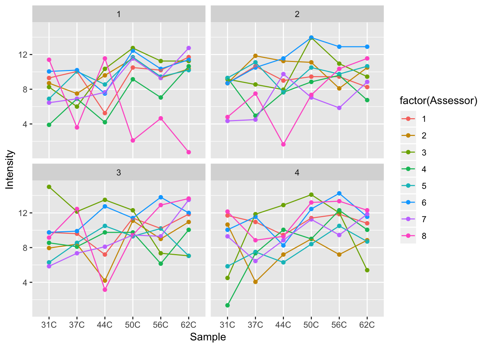

# basicR4FOOD
Course materiale for intensive R course at Dept FOOD UPCH 

## Program
__Where__: Copenhagen Plant Science Center aud 1 (CPSC1)

__When__: Tuesday, January 22nd, 2019

__10-11__	: R environment, Import data, data.frame as the _golden object_, simple plot (hist()) 

__11-12__	: Descriptives (table(), aggregate())

__12-13__	: Lunch and Data-social

__13-14__	: ggplot2 [scatterplots, barcharts, boxplot, jitter]

__14-15__	: linear models and t.test

__15-16__	: PCA with ggbiplot and extraction of scores/loads -> into data.frame and ggplot2 plots


## Installation of R and Rstudio
Take a look in the file [installation_guide](https://github.com/mortenarendt/basicR4FOOD/blob/master/Installation_guide.pdf)

## Datasets
Datasets for this course is included the dataset folder [/data](https://github.com/mortenarendt/basicR4FOOD/tree/master/data)

* __Coffee temp__ (Temperature_Coffee.xlsx): A sensorical panel accessing the sensory properties of coffee brewed at different temperatures. 

* __GC-Cheese__ (cheese_aromas.xlsx): Aromaprofiling of chesses produces under different conditions over different storage times. 

* __Mouse__ (Mouse_diet_intervention.xlsx): Dietary effects of whey, casein as well as high low fat diet on growth and biomarkers in a mice model. 

## Additional material 

### Notes from the _Data Analysis in Food Science_ course
There is a lot of online available material on statistics using R. The [Notes for Data Analysis in Food Science](https://github.com/mortenarendt/basicR4FOOD/blob/master/Notes_FDA.pdf) covers basic data analysis in eight weeks. Data for most of the content there is to be found [here](https://github.com/mortenarendt/DataAnalysisinFoodScience/) and can be downloaded directly in R using the _devtools_ package: 


```r
devtools::install_github('mortenarendt/DataAnalysisinFoodScience')
library(DAinFoodScience)
data("maramaox") 
```

### Cheatsheets

RStudio has made available [Cheatsheets](https://www.rstudio.com/resources/cheatsheets/) covering the utility of different packages, such as _ggplot2_. These are very condensed, but also very usefull for checking out what you can do with a particular package. 

### Videos

For the _Data Analysis in Food Science_ course, there is a bunch of videos available going through theory and _How to_ in R. These can be found on youtube [here](https://www.youtube.com/playlist?list=PL4L59zaizb3FmBdxuDLRdzGsknTrZN6Ys). 


## Import data

Download the excel datafiles to an appropriate location on your computer. Further, install the _rio_ package 
(This you only need to do once). 


```r
install.packages('rio')
```
Make a script containing the stuff below, save the file in the same place as the data, and set the working directory to the source file location using Session > Set Working Directory. 


```r
library(rio)
X <- import('data/Temperature_Coffee.xlsx')
```

## Summary stats

Lets calculate the mean for the attribute _Intensity_ (one of the variables in the dataset) for each temperature setting


```r
aggregate(X$Intensity, list(X$Sample),mean)
```

```
##   Group.1         x
## 1     31C  8.306250
## 2     37C  8.620313
## 3     44C  8.517188
## 4     50C 10.528125
## 5     56C  9.946875
## 6     62C 10.110938
```
... Now lets do it for all attributes. 


```r
aggregate(X, list(X$Sample),mean)
```

```
##   Group.1 Sample Assessor Replicate Intensity     Sour    Bitter    Sweet
## 1     31C     NA      4.5       2.5  8.306250 8.451562  9.487500 3.285938
## 2     37C     NA      4.5       2.5  8.620313 9.075000  8.873437 4.143750
## 3     44C     NA      4.5       2.5  8.517188 7.087500  9.281250 4.659375
## 4     50C     NA      4.5       2.5 10.528125 7.589062 10.115625 3.046875
## 5     56C     NA      4.5       2.5  9.946875 8.268750 10.598437 2.868750
## 6     62C     NA      4.5       2.5 10.110938 7.790625  9.632812 3.314062
##     Tobacco  Roasted    Nutty Chocolate
## 1 10.420312 7.884375 3.829687  8.057813
## 2  9.979688 8.695312 3.914062  7.650000
## 3  8.878125 8.882812 4.410938  7.856250
## 4  9.529687 9.660937 4.743750  7.659375
## 5 10.120313 9.693750 3.829687  6.820312
## 6  8.835938 9.787500 4.195312  6.510937
```

... And lets get some more summary stats returned as well


```r
aggregate(X, list(X$Sample),function(x) c(length(x), mean(x), sd(x)))
```

```
##   Group.1 Sample.1 Sample.2 Sample.3 Assessor.1 Assessor.2 Assessor.3
## 1     31C       32       NA       NA  32.000000   4.500000   2.327951
## 2     37C       32       NA       NA  32.000000   4.500000   2.327951
## 3     44C       32       NA       NA  32.000000   4.500000   2.327951
## 4     50C       32       NA       NA  32.000000   4.500000   2.327951
## 5     56C       32       NA       NA  32.000000   4.500000   2.327951
## 6     62C       32       NA       NA  32.000000   4.500000   2.327951
##   Replicate.1 Replicate.2 Replicate.3 Intensity.1 Intensity.2 Intensity.3
## 1   32.000000    2.500000    1.135924   32.000000    8.306250    2.749479
## 2   32.000000    2.500000    1.135924   32.000000    8.620313    2.452052
## 3   32.000000    2.500000    1.135924   32.000000    8.517188    2.780450
## 4   32.000000    2.500000    1.135924   32.000000   10.528125    2.399225
## 5   32.000000    2.500000    1.135924   32.000000    9.946875    2.325800
## 6   32.000000    2.500000    1.135924   32.000000   10.110938    2.625549
##      Sour.1    Sour.2    Sour.3  Bitter.1  Bitter.2  Bitter.3   Sweet.1
## 1 32.000000  8.451562  2.699357 32.000000  9.487500  2.569706 32.000000
## 2 32.000000  9.075000  2.476502 32.000000  8.873437  2.559832 32.000000
## 3 32.000000  7.087500  2.268792 32.000000  9.281250  2.575560 32.000000
## 4 32.000000  7.589062  2.639059 32.000000 10.115625  2.401190 32.000000
## 5 32.000000  8.268750  2.850064 32.000000 10.598437  2.495075 32.000000
## 6 32.000000  7.790625  3.185842 32.000000  9.632812  3.132494 32.000000
##     Sweet.2   Sweet.3 Tobacco.1 Tobacco.2 Tobacco.3 Roasted.1 Roasted.2
## 1  3.285938  1.758126 32.000000 10.420312  2.430945 32.000000  7.884375
## 2  4.143750  2.022086 32.000000  9.979688  2.092030 32.000000  8.695312
## 3  4.659375  2.759542 32.000000  8.878125  2.833638 32.000000  8.882812
## 4  3.046875  1.528015 32.000000  9.529687  2.791198 32.000000  9.660937
## 5  2.868750  1.672392 32.000000 10.120313  2.494603 32.000000  9.693750
## 6  3.314062  2.308233 32.000000  8.835938  3.016253 32.000000  9.787500
##   Roasted.3   Nutty.1   Nutty.2   Nutty.3 Chocolate.1 Chocolate.2
## 1  2.735502 32.000000  3.829687  1.885080   32.000000    8.057813
## 2  2.543155 32.000000  3.914062  1.643326   32.000000    7.650000
## 3  2.125331 32.000000  4.410938  2.158245   32.000000    7.856250
## 4  2.256558 32.000000  4.743750  1.817955   32.000000    7.659375
## 5  2.763960 32.000000  3.829687  1.555109   32.000000    6.820312
## 6  2.664552 32.000000  4.195312  1.609917   32.000000    6.510937
##   Chocolate.3
## 1    2.202971
## 2    2.518928
## 3    3.709572
## 4    2.980324
## 5    2.767696
## 6    3.090770
```
          
## Simple plots with ggplot2

First, import the package _ggplot2_

```r
install.packages('ggplot2')
```

Now let's make a plot of the Intensity (on the y-axis) versus the temperature (on the x-axis) and color all the responses according to the Assessor


```r
library(ggplot2)
ggplot(data = X, aes(Sample, Intensity, color = factor(Assessor))) + 
  geom_point()
```

<!-- -->
Now, lets join the points within each assessor (and replicate), and further, plot each replicate in its own panel. 


```r
ggplot(data = X, aes(Sample, Intensity, color = factor(Assessor), group = factor(Assessor))) + 
  geom_point() + geom_line() + 
  facet_wrap(~Replicate)
```

<!-- -->

Instead of the raw data you might want to see the means of each design cell (temperature and assessor). We can calculate that as described above with aggregate() - and plot it!


```r
Xm <- aggregate(X, list(X$Sample, X$Assessor),mean)
colnames(Xm)[1] <- 'Temp'
ggplot(data = Xm, aes(Temp, Intensity, color = factor(Assessor), group = factor(Assessor))) + 
  geom_point() + geom_line()
```

<!-- -->
